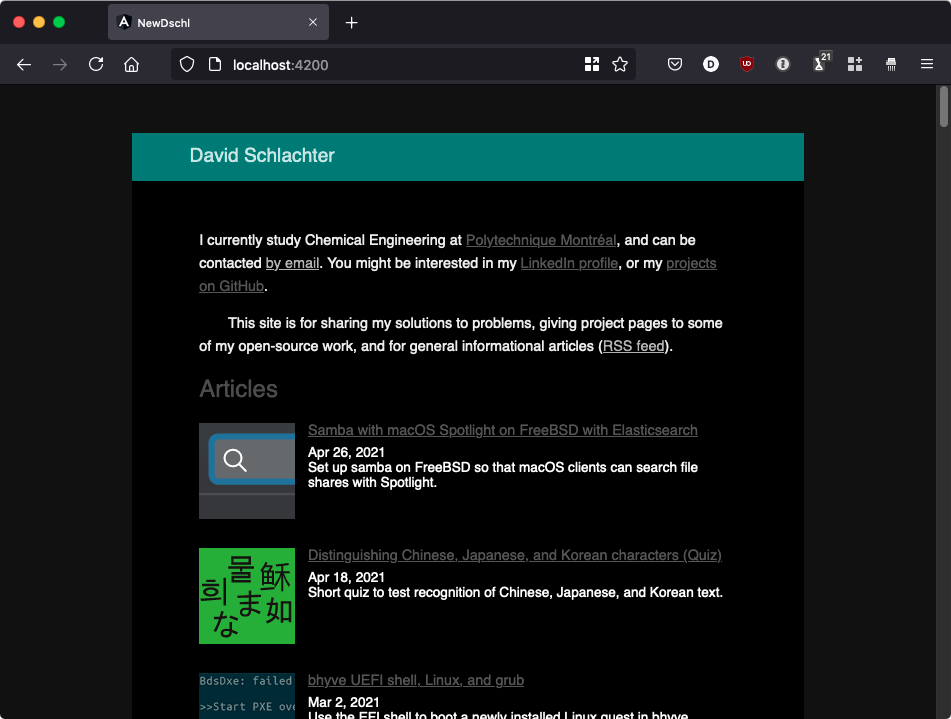

Clone of [https://www.davidschlachter.com/](https://www.davidschlachter.com/). Goal: learn about the [Angular](https://angular.io/) framework.

Currently reads the list of articles from a JSON file, creates the layout & dynamically determines the colour highlights. To do: render individual articles, add the navigation.

